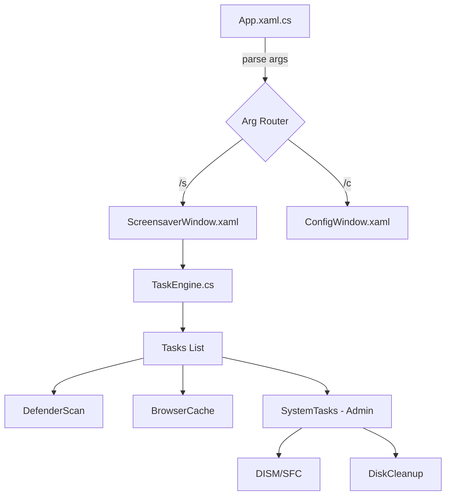

# ◈ Maintenance OS

[](https://github.com/Beardicuss/Maintenance-OS/actions)
[](LICENSE)
[](https://dotnet.microsoft.com/download/dotnet/8.0)
[](https://github.com/Beardicuss/Maintenance-OS/releases)
[](https://www.microsoft.com/windows)

**A professional Windows screensaver (.scr) with a cyberpunk neon UI that performs background system maintenance while your PC is idle.**

---

## 📋 Table of Contents

- [Overview](#overview)
- [✨ Features](#-features)
- [📦 Installation](#-installation)
- [🚀 Quick Start](#-quick-start)
- [📖 Documentation](#-documentation)
- [🔧 Configuration](#-configuration)
- [💡 Advanced Usage](#-advanced-usage)
- [🏗️ Architecture](#️-architecture)
- [🧪 Testing](#-testing)
- [🤝 Contributing](#-contributing)
- [Roadmap](#roadmap)
- [📄 License](#-license)
- [👥 Acknowledgements](#-acknowledgements)
- [💬 Support](#-support)

---

## Overview

Maintenance OS is more than just a screensaver. It is a background maintenance engine designed for power users who want their hardware to stay healthy without manual intervention. When your system goes idle, the screensaver activates a high-fidelity cyberpunk terminal that executes a suite of optimization and security tasks in real-time.

### The Problem It Solves
System maintenance (defragmentation, cache purging, virus scanning) often happens at inconvenient times or is forgotten entirely. Maintenance OS utilizes your system's idle time to perform these essential tasks, ensuring your environment remains performant and secure.

### Who is it for?
- **Developers** who want automated environment cleanup.
- **Enthusiasts** who love cyberpunk aesthetics (neon, glassmorphism, CRT effects).
- **System Administrators** looking for a non-intrusive way to run periodic maintenance on workstations.

---

## ✨ Features

- 🟢 **Windows Defender Quick Scan**: Automated malware scanning via `MpCmdRun.exe`.
- 🧹 **Browser Cache Purge**: Deep cleaning for Chrome, Edge, and Firefox.
- 🛡️ **Malicious Process Guard**: Real-time SHA-256 process verification against known threat intelligence.
- 🔍 **File Integrity Monitor**: Passive monitoring of critical system directories (`System32`, `SysWOW64`).
- 💿 **Auto Defragmentation**: Analysis and optimization of NTFS volumes (Admin only).
- 🧼 **Disk Cleanup**: Silent execution of `cleanmgr` with pre-configured high-impact categories (Admin only).
- 🛠️ **DISM Component Store**: Automated component cleanup and SFC verification (Admin only).
- 📟 **Cyberpunk UI**: A stunning, full-screen glassmorphic interface with live scrolling logs and retro-futuristic animations.

---

## 📦 Installation

### Prerequisites
- **OS**: Windows 10 or 11 (x64)
- **Runtime**: [.NET 8 Desktop Runtime](https://dotnet.microsoft.com/download/dotnet/8.0)
- **Build Tools**: .NET 8 SDK (required to build from source)

### Method 1: Build from Source (Recommended)
1. Clone the repository:
   ```bash
   git clone https://github.com/Beardicuss/Maintenance-OS.git
   cd Maintenance-OS
   ```
2. Build the project:
   ```bash
   build.bat
   ```
3. The screensaver file (`SoftcurseLab.scr`) will be located in the `build/` directory.

### Method 2: Manual Installation
1. Move `SoftcurseLab.scr` to `C:\Windows\System32`.
2. Right-click the file and select **Install**.

---

## 🚀 Quick Start

1. **Build the screensaver**: Run `build.bat`.
2. **Install to System32**: Run `install.bat` as Administrator.
3. **Wait for Idle**: Or lock your PC (if configured via Task Scheduler).
4. **Watch it Work**: The screensaver will launch, and you'll see the task engine starting maintenance jobs in the live log.

To preview immediately without waiting:
```bash
build\SoftcurseLab.scr /s
```

---

## 📖 Documentation

The project follows the standard Windows screensaver lifecycle. When launched, the `TaskEngine` initializes all registered `BaseTask` implementations.

- **Non-Admin Tasks**: Run immediately in parallel.
- **Admin Tasks**: Wait for elevation and run sequentially to manage I/O load.
- **UI Logic**: Handled via WPF with custom CRT shaders and transparency effects.

For a deep dive into the source, see the [Architecture](#️-architecture) section.

---

## 🔧 Configuration

### Command Line Arguments
The `.scr` executable supports standard Windows screensaver flags:
- `/s`: Start in full-screen mode (Screen Saver).
- `/p <HWND>`: Preview in the Screensaver settings dialog.
- `/c`: Open the configuration window.

### Built-in Settings
Run the screensaver with `/c` or double-click the `.scr` and select **Settings** to:
- Toggle specific maintenance tasks.
- Adjust log levels.
- Configure scan depths.

---

## 💡 Advanced Usage

### Task Scheduler Deployment
For the best experience, run as `SYSTEM` to ensure all administrative tasks succeed without UAC prompts:
1. Run `setup_task_scheduler.bat` as Administrator.
2. This creates a task that triggers when the workstation is locked.

### Custom Threat Intel
You can add your own malicious hashes to the `ProcessGuardTask`:
1. Edit `src/Core/Tasks/ProcessGuardTask.cs`.
2. Add SHA-256 hashes to the `MaliciousHashes` set.
3. Rebuild.

---

## 🏗️ Architecture



### Core Components
- **`TaskEngine`**: The heartbeat of the system. manages lifecycle and logging.
- **`BaseTask`**: Abstract class providing `RunProcessAsync` and elevation checks.
- **`ScreensaverWindow`**: WPF View with cyberpunk styling and a live-updating `ObservableCollection` log.

---

## 🧪 Testing

The project uses XUnit for core logic testing (where applicable).
To run tests:
```bash
dotnet test
```
*Note: Some tests require administrative privileges to verify hardware-level tasks.*

---

## 🤝 Contributing

We love contributions! Whether it's a new maintenance task, a UI enhancement, or a bug fix.
- Please read our [CONTRIBUTING.md](.github/CONTRIBUTING.md).
- Follow the [Code of Conduct](.github/CODE_OF_CONDUCT.md).

---

## Roadmap

- [ ] **Docker Cache Purge**: Specific task for cleaning up unused Docker layers.
- [ ] **Registry Health**: Symbolic link verification and dead-path detection.
- [ ] **Remote Logging**: Send maintenance reports to a central server/webhook.
- [ ] **More Themes**: Dark/Light variants of the Cyberpunk UI.

---

## 📄 License

Distributed under the **MIT License**. See [LICENSE](LICENSE) for more information.

---

## 👥 Acknowledgements

- **WPF UI**: Inspired by vintage terminal interfaces.
- **Maintenance Tools**: Leverages Microsoft's `MpCmdRun`, `cleanmgr`, and `DISM`.
- **Icons**: Provided by Lucide-React/Material Design.

---

## 💬 Support

- **Bug Reports**: Open an issue [here](https://github.com/Beardicuss/Maintenance-OS/issues).
- **Discussions**: Join our [GitHub Discussions](https://github.com/Beardicuss/Maintenance-OS/discussions).
- **Security**: Please see our [Security Policy](.github/SECURITY.md).
